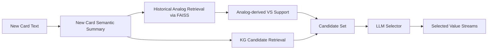
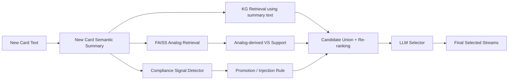
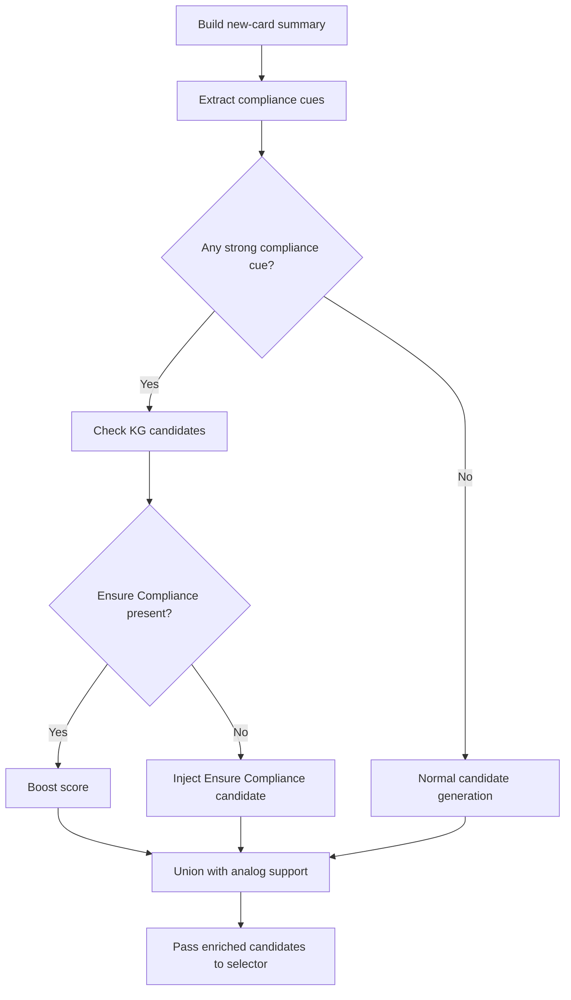

# Ensure Compliance Recall Improvement Approach

## Goal

Improve recall for **Ensure Compliance** when the new card clearly contains compliance-related language, but the current summary-RAG pipeline fails to surface it as a strong candidate before final LLM selection.

This is meant as a **practical, staged approach**:

- **Short-term:** fix the failure quickly and safely
- **Medium-term:** make the behavior systematic
- **Long-term:** replace heuristics with a proper multi-signal candidate scoring layer

---

## Why the current pipeline misses it

The main problem is usually **upstream of final selection**.

Current high-level flow:



### Failure mode

`Ensure Compliance` gets dropped because of a two-part failure:

1. **Candidate recall failure**
   - KG retrieval does not return `Ensure Compliance` strongly enough
   - semantically nearby streams may appear instead:
     - Manage Enterprise Risk
     - Resolve Privacy Incident
     - Administer Quality Management Program

2. **Weak analog ranking**
   - historical analog support may contain `Ensure Compliance`
   - but it is ranked low behind stronger product / engagement / member / finance streams

### Result

The selector cannot recover it if it is absent or too weak in the candidate set.

---

## Recommended approach

## 1. Best short-term approach

This is the best **practical immediate fix**.

### Core idea

Use **three signals together**:

1. **Summary-based KG retrieval**
2. **Aggressive analog-support union**
3. **Compliance-specific promotion rule**

### Updated flow



### Why this is the best short-term fix

Because it is:

- easy to implement
- low risk
- targeted to the actual failure mode
- likely to improve recall quickly for compliance-heavy tickets like 8199 and 8280

---

## 2. Short-term implementation details

## A. Use summary text for KG retrieval

### Current issue
Raw cleaned text can be noisy and dominated by broader business themes.

### Fix
Use the **new-card semantic summary retrieval text** as the primary KG query.

Example:

```python
kg_query_text = build_retrieval_text(new_card_summary).strip() or cleaned_text
candidates = retrieve_kg_candidates(
    kg_query_text,
    top_k=max_candidate_streams,
    allowed_names=allowed_value_stream_names,
)
```

### Why this helps
The summary compresses the card into stronger business signals like:

- privacy
- PII
- audit
- controls
- HIPAA
- regulatory
- consent
- compliance

rather than letting them get buried inside general product or engagement text.

---

## B. Union KG candidates with analog-derived VS support

### Current issue
A stream may exist in analog-derived support but never make it into the candidate set strongly enough.

### Fix
Always union:

- KG candidates
- analog-derived value-stream support candidates

Then deduplicate by normalized stream name.

### Why this helps
If `Ensure Compliance` appears in analog support, it should not be lost just because KG missed it.

---

## C. Add a compliance promotion rule

### Core rule
If the new card has explicit compliance-related language, **promote or inject `Ensure Compliance`** even if KG retrieval missed it.

### Suggested trigger vocabulary

Promote `Ensure Compliance` when the new-card summary or raw text contains one or more of:

- privacy
- PII
- audit
- controls
- balancing
- regulatory
- compliance
- HIPAA
- consent
- governance
- security controls

### Strong trigger examples
These should be high-confidence promotion triggers:

- `data contains PII`
- `audit, balancing, and controls`
- `regulatory compliance`
- `privacy implications`
- `HIPAA`
- `consent controls`

### Suggested promotion behavior

If:
- compliance terms are present in the new-card summary or raw text
- and `Ensure Compliance` exists in analog support or known canonical value streams

Then:
- always add `Ensure Compliance` to the candidate list if missing
- or boost its score significantly if already present

---

## 3. Suggested decision logic



### Pseudocode

```python
COMPLIANCE_TERMS = {
    "privacy", "pii", "audit", "controls", "balancing",
    "regulatory", "compliance", "hipaa", "consent",
    "governance", "security controls"
}

def has_compliance_signal(text: str) -> bool:
    t = (text or "").lower()
    return any(term in t for term in COMPLIANCE_TERMS)

def promote_ensure_compliance(
    candidates: list[dict],
    analog_vs_support: list[dict],
    summary_text: str,
    raw_text: str,
) -> list[dict]:
    combined_text = f"{summary_text}\n{raw_text}".lower()

    if not has_compliance_signal(combined_text):
        return candidates

    existing = {normalize(c.get("entity_name", "")): c for c in candidates}

    ensure_name = "Ensure Compliance"
    ensure_key = normalize(ensure_name)

    if ensure_key in existing:
        existing[ensure_key]["score"] = max(
            float(existing[ensure_key].get("score", 0.0)),
            0.85,
        )
        existing[ensure_key]["promotion_reason"] = "compliance_signal_trigger"
        return list(existing.values())

    analog_hit = next(
        (x for x in analog_vs_support if normalize(x.get("entity_name", "")) == ensure_key),
        None,
    )

    candidates.append({
        "entity_id": "",
        "entity_name": ensure_name,
        "description": "Promoted due to explicit compliance/privacy/audit signals in the idea card.",
        "score": 0.85 if analog_hit else 0.75,
        "source": "compliance_promotion_rule",
        "support_count": int(analog_hit.get("support_count", 0)) if analog_hit else 0,
    })
    return candidates
```

---

## 4. Why this is good, but not the final architecture

This approach is strong **for now**, but it is still partly heuristic.

### What is good about it
- directly addresses the known failure mode
- easy to reason about
- transparent
- safe to test
- improves recall without redesigning the whole system

### What is weak about it
Over time, this can turn into many special-case rules:

- compliance rules
- provider-network rules
- billing rules
- risk rules
- member-service rules

That becomes harder to maintain.

So this should be treated as a **recall guardrail**, not the permanent final solution.

---

## 5. Best medium-term approach

Replace one-off promotion rules with a **capability-to-value-stream expansion layer**.

### Core idea

Map concepts to likely value streams systematically.

Example:

| Capability / cue | Promoted value stream |
|---|---|
| privacy, PII, audit, controls, HIPAA, consent | Ensure Compliance |
| fraud, exposure, governance, enterprise risk | Manage Enterprise Risk |
| provider setup, onboarding, contracting | Establish Provider Network / Program |
| invoice, billing, payment, collections | Order to Cash / Manage Invoice and Payment |

### Why this is better
Instead of scattered manual logic, you create a small, explicit ontology layer between:

- extracted business capabilities
- final value streams

---

## 6. Best long-term approach

Build a proper **multi-signal candidate scoring layer**.

### Final target idea

Each value stream gets a combined score from several signals:

```text
final_score =
    semantic_similarity
  + analog_support_score
  + ontology_match_score
  + sparse_keyword_match
  + summary_field_overlap
```

### Example scoring model

```text
final_score(vs) =
    0.35 * kg_semantic_score
  + 0.25 * analog_support_score
  + 0.20 * ontology_match_score
  + 0.10 * exact_keyword_score
  + 0.10 * summary_field_overlap
```

### Why this is the best final design
Because then `Ensure Compliance` is not added due to a hacky one-off rule.

It wins naturally because:

- the summary contains privacy/audit/PII clues
- the ontology maps those clues toward compliance
- analog evidence supports it
- exact keyword matching reinforces it

That is the best long-term architecture.

---

## 7. Recommended rollout plan

## Phase 1 — immediate patch
Implement now:

- use summary text for KG retrieval
- union KG candidates with analog-derived support
- add compliance promotion rule

### Expected benefit
Fast recall improvement for compliance-heavy tickets.

---

## Phase 2 — structured promotion layer
Next:

- create a small mapping file from business cues to value streams
- generalize beyond compliance

### Expected benefit
Cleaner, more systematic behavior.

---

## Phase 3 — multi-signal scorer
Later:

- replace promotion heuristics with a real candidate scoring stage

### Expected benefit
Better precision and recall across all value streams, not just compliance.

---

## 8. Final recommendation

### Best short-term answer
**Yes** — use the summary text + analog support union + compliance promotion rule.

That is the best **practical near-term approach** for your current system.

### Best overall answer
**No** — it is not the best final architecture.

The best final architecture is a **multi-signal candidate generation and scoring layer** where:

- semantic retrieval
- analog evidence
- ontology mapping
- exact cue matching

all work together in a principled way.

---

## 9. One-line summary

Use the rule-based promotion now as a **recall guardrail**, but plan to replace it with a proper **multi-signal candidate scoring layer** later.
