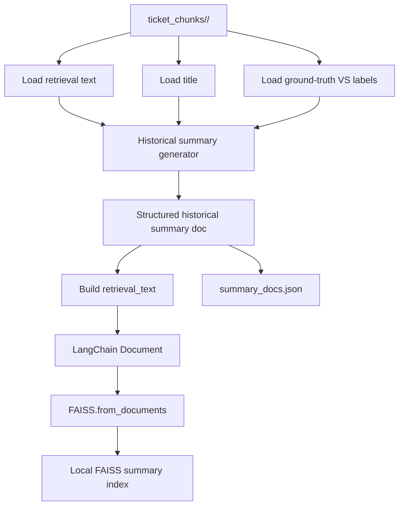
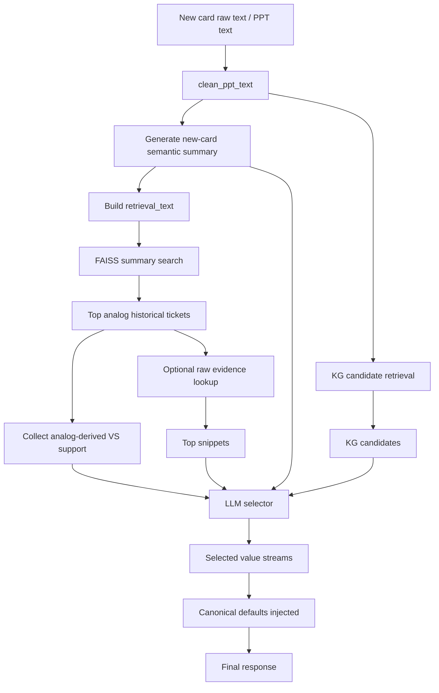
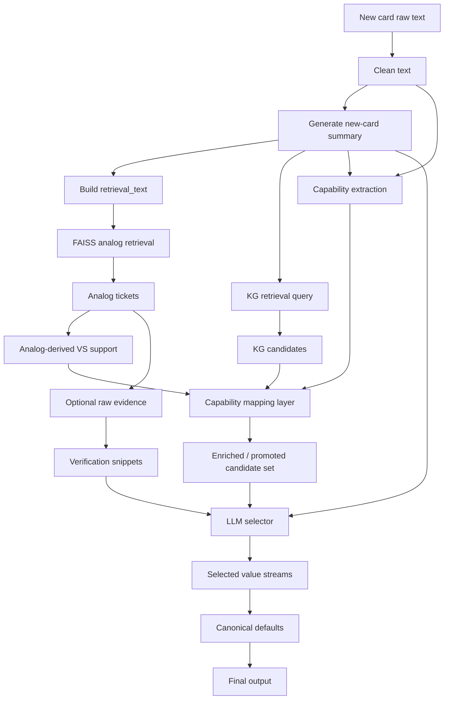
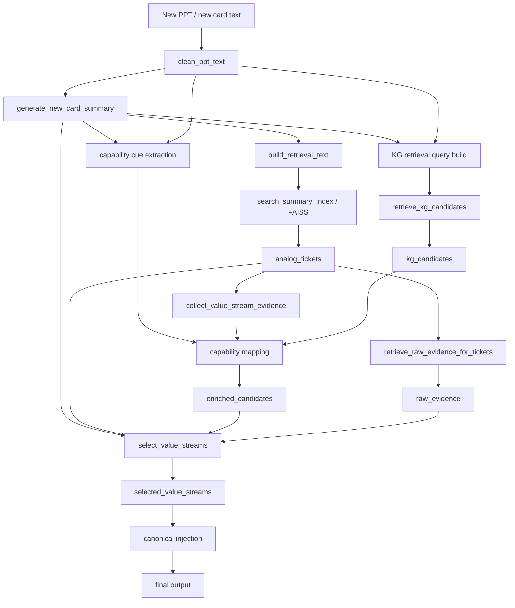

# Summary-RAG Architecture with Capability Mapping

## Purpose

This document explains the **complete summary-RAG architecture** and shows exactly where **capability mapping** fits in the workflow.

It covers:

- package structure
- historical index build flow
- runtime inference flow for a new card
- data schemas
- where capability mapping should sit
- why it helps
- a worked example at the end

---

# 1. Big picture

Your current system has **two major phases**:

1. **Historical preparation / indexing**
   - build semantic summaries for historical tickets
   - store them in a local FAISS summary index

2. **Runtime inference for a new card**
   - summarize the new card
   - retrieve analogous historical tickets from FAISS
   - retrieve value-stream candidates from the KG
   - combine evidence
   - select final value streams

Capability mapping belongs in the **runtime inference phase**, between **evidence gathering** and **final candidate assembly**.

---

# 2. Current package structure

```text
summary_rag/
├── build_index.py
├── pipeline.py
├── generation/
│   └── selector.py
├── ingestion/
│   ├── faiss_indexer.py
│   └── summary_generator.py
└── retrieval/
    └── summary_retriever.py
```

## Responsibility of each module

### `ingestion/summary_generator.py`
Creates structured semantic summaries for:

- historical tickets
- new idea cards

It also builds the packed retrieval text used for vector search.

### `ingestion/faiss_indexer.py`
Owns the local historical summary index.

It:
- converts summary docs into LangChain `Document`s
- builds the FAISS index
- loads the FAISS index
- searches the FAISS index
- batch-generates historical summaries from `ticket_chunks/<ticket_id>/...`

### `retrieval/summary_retriever.py`
Owns runtime retrieval around the summary index.

It:
- queries FAISS for analog tickets
- collects analog-derived value-stream support
- optionally fetches late-stage raw snippets
- retrieves KG candidates

### `generation/selector.py`
Owns the final LLM selection.

It receives:
- new-card summary
- analog summaries
- KG candidates
- optional raw evidence
- analog-derived VS support

Then it picks final value streams.

### `pipeline.py`
Owns orchestration.

It runs the whole runtime flow in order.

### `build_index.py`
Thin CLI wrapper to rebuild the historical summary FAISS index.

---

# 3. Historical indexing architecture

The historical side converts existing ticket artifacts into a **semantic analog memory**.

## Source artifacts per ticket

The index builder reads from the existing `ticket_chunks/<ticket_id>/...` folder, typically using:

- `03_retrieval_views.json`
- `02_attachment_text.json`
- `01_ticket_data.json`
- `08_valuestream_map.json`

These are used to recover:
- text
- title
- known ground-truth value-stream labels

## Historical indexing flow



## Historical summary schema

Each historical summary doc looks like this:

```json
{
  "doc_id": "summary_IDMT-19761",
  "ticket_id": "IDMT-19761",
  "title": "Employer/member advocacy launch",
  "short_summary": "Launch of a new member advocacy and navigation offering.",
  "business_goal": "new healthcare product launch",
  "actors": ["member", "provider", "employer"],
  "direct_functions": ["product offering", "engagement", "care coordination"],
  "implied_functions": ["provider setup", "pricing", "billing", "IT enablement"],
  "change_types": ["new capability", "operational rollout"],
  "domain_tags": ["clinical", "operational", "member experience"],
  "evidence_sentences": [
    "Launch a new employer/member advocacy solution",
    "Improve navigation and care coordination"
  ],
  "value_stream_labels": ["Establish Product Offering", "Perform Engagement"]
}
```

## FAISS document schema

That summary doc is converted into a LangChain `Document`:

### `page_content`
A packed retrieval string made from fields like:
- title
- short summary
- business goal
- actors
- functions
- domains
- value stream labels

### `metadata`
Metadata typically contains:
- `doc_id`
- `ticket_id`
- `title`
- `short_summary`
- `business_goal`
- `actors`
- `direct_functions`
- `implied_functions`
- `change_types`
- `domain_tags`
- `evidence_sentences`
- `value_stream_labels`
- `doc_type = "ticket_summary"`

So FAISS stores **semantic memory of historical tickets**, not raw chunk noise.

---

# 4. Runtime inference architecture for a new card

At runtime, the system processes a new PPT / idea card.

## Current summary-RAG runtime flow



This is already much better than the old raw-chunk-first approach.

But it still has a blind spot:

- some exact value streams are semantically understood
- yet they do not survive candidate recall strongly enough
- `Ensure Compliance` is the clearest example

That is where capability mapping fits.

---

# 5. Where capability mapping should fit

## Best insertion point

Capability mapping should sit **after summary generation** and **before final selector input is frozen**.

That means it should operate after you already have:

- `new_card_summary`
- `analog_tickets`
- `vs_support`
- `KG candidates`

and before the final candidate set goes to `selector.py`.

## Why here?

Because capability mapping is neither:

- a pure summarization step
- nor the final selection step

It is a **candidate enrichment and promotion layer**.

Its job is:

1. read business cues from the new-card summary (and optionally raw text)
2. map those cues to business capabilities
3. map those capabilities to likely value streams
4. promote or inject those streams into the candidate set

## Updated architecture with capability mapping



---

# 6. What capability mapping actually does

Capability mapping is a **bridge layer** between business language and value streams.

## Example

Suppose the summary contains:

- privacy
- PII
- audit
- controls
- HIPAA
- regulatory
- consent

Capability mapping groups those into a capability cluster like:

- `Compliance / Privacy / Audit`

Then that capability cluster promotes:

- `Ensure Compliance`

So it is not directly doing final ranking.
It is doing **recall repair** and **candidate enrichment**.

## Inputs to capability mapping

It should consume:

- `new_card_summary`
- optionally `cleaned_text`
- `vs_support` from analog tickets
- `candidates` from KG retrieval

## Outputs from capability mapping

It should produce:

- `capability_hits`
- `promoted_value_streams`
- `enriched_candidates`

---

# 7. Proposed runtime data schema with capability mapping

## New-card summary schema

```json
{
  "short_summary": "New data-sharing workflow with privacy and regulatory implications.",
  "business_goal": "Improve vendor/member data handling with stronger control requirements.",
  "actors": ["member", "vendor", "internal operations"],
  "direct_functions": ["data workflow", "controls", "processing"],
  "implied_functions": ["privacy compliance", "audit controls"],
  "change_types": ["process improvement", "governance hardening"],
  "domain_tags": ["privacy", "compliance", "operational"],
  "evidence_sentences": [
    "Data contains PII",
    "Audit, balancing, and controls are required"
  ]
}
```

## Analog-derived VS support schema

```json
[
  {
    "entity_name": "Ensure Compliance",
    "support_count": 2,
    "best_score": 0.61,
    "supporting_ticket_ids": ["IDMT-8199", "IDMT-8280"]
  },
  {
    "entity_name": "Manage Enterprise Risk",
    "support_count": 3,
    "best_score": 0.67,
    "supporting_ticket_ids": ["IDMT-8199", "IDMT-7777", "IDMT-6001"]
  }
]
```

## KG candidate schema

```json
[
  {
    "entity_id": "VSR001",
    "entity_name": "Manage Enterprise Risk",
    "score": 0.72,
    "description": "..."
  },
  {
    "entity_id": "VSR002",
    "entity_name": "Resolve Privacy Incident",
    "score": 0.68,
    "description": "..."
  }
]
```

## Capability mapping output schema

```json
{
  "capability_hits": [
    {
      "capability": "Compliance / Privacy / Audit",
      "matched_terms": ["PII", "audit", "controls", "privacy", "regulatory"],
      "strength": 0.95
    }
  ],
  "promoted_value_streams": [
    {
      "entity_name": "Ensure Compliance",
      "promotion_reason": "capability_mapping",
      "score_boost": 0.35
    }
  ],
  "enriched_candidates": [
    {
      "entity_name": "Ensure Compliance",
      "source": "capability_mapping",
      "score": 0.85
    }
  ]
}
```

---

# 8. Capability mapping logic in practice

## Stage A — extract cues

From:
- `short_summary`
- `business_goal`
- `direct_functions`
- `implied_functions`
- `domain_tags`
- `evidence_sentences`
- optionally raw text

Extract business cues.

### Example cue groups

#### Compliance / Privacy / Audit
- privacy
- PII
- audit
- controls
- balancing
- regulatory
- compliance
- HIPAA
- consent
- data governance

#### Provider network / onboarding
- provider setup
- provider onboarding
- contracting
- network expansion

#### Billing / order-to-cash
- invoice
- billing
- payment
- collections
- remittance

## Stage B — map cue group to value streams

Example map:

| Capability cluster | Promote value streams |
|---|---|
| Compliance / Privacy / Audit | Ensure Compliance |
| Enterprise risk / governance | Manage Enterprise Risk |
| Provider onboarding / network | Establish Provider Network, Establish Provider Program |
| Billing / collections / invoicing | Order to Cash, Manage Invoice and Payment |
| Enrollment / quoting | Sell and Enroll, Configure Price and Quote |

## Stage C — merge with candidate set

Capability mapping should then:

- boost existing matching candidates
- inject missing candidates if they are strongly implied
- tag promoted candidates with source = `capability_mapping`

---

# 9. Recommended full runtime architecture now

This is the architecture I would recommend for your summary-RAG now.



---

# 10. Why capability mapping should not sit elsewhere

## Not inside summary generation
Because summary generation should stay focused on:
- understanding the new card
- producing structured meaning

If you mix capability promotion into summary generation, the summary step becomes opinionated ranking logic instead of a clean semantic abstraction layer.

## Not only inside the selector
Because by the time you reach the selector, missing streams may already be gone from the candidate list.

That is exactly the failure you saw with `Ensure Compliance`.

## Not inside FAISS retrieval
FAISS retrieval is about analog memory, not business rule expansion.

Capability mapping should consume analog evidence, not be buried inside retrieval.

So the cleanest place is:

**after evidence gathering, before final selection**

---

# 11. Step-by-step example

Now let’s run one example through the full architecture.

## New card text

Suppose the new card says:

> Launch a new vendor/member data-sharing workflow. Data contains PII. Audit, balancing, and controls are required. There are privacy and regulatory implications.

## Step 1 — clean text
The raw PPT text is cleaned and normalized.

## Step 2 — generate new-card summary
The summary generator produces:

```json
{
  "short_summary": "New vendor/member data-sharing workflow with privacy and regulatory implications.",
  "business_goal": "Enable operational data sharing while maintaining control and compliance.",
  "actors": ["member", "vendor", "internal operations"],
  "direct_functions": ["data workflow", "controls"],
  "implied_functions": ["privacy compliance", "audit controls"],
  "change_types": ["process improvement"],
  "domain_tags": ["privacy", "compliance", "operational"],
  "evidence_sentences": [
    "Data contains PII",
    "Audit, balancing, and controls are required"
  ]
}
```

## Step 3 — FAISS analog retrieval
The retrieval text built from that summary is used to search the historical summary index.

Top analogs might be:

- `IDMT-8280`
- `IDMT-8199`
- `IDMT-6001`

These analogs may carry ground-truth labels like:
- Ensure Compliance
- Manage Enterprise Risk
- Manage Member Care

## Step 4 — analog-derived VS support
From those analogs, the system aggregates support:

```json
[
  {
    "entity_name": "Ensure Compliance",
    "support_count": 2,
    "best_score": 0.61,
    "supporting_ticket_ids": ["IDMT-8199", "IDMT-8280"]
  },
  {
    "entity_name": "Manage Enterprise Risk",
    "support_count": 3,
    "best_score": 0.67,
    "supporting_ticket_ids": ["IDMT-8199", "IDMT-8280", "IDMT-6001"]
  }
]
```

## Step 5 — KG retrieval
KG retrieval might return:

- Manage Enterprise Risk
- Resolve Privacy Incident
- Administer Quality Management Program

but **not** `Ensure Compliance`.

This is the exact recall gap capability mapping is meant to fix.

## Step 6 — capability mapping
Capability mapping reads the new-card summary and sees:

- PII
- audit
- controls
- privacy
- regulatory

It maps them to:

- `Compliance / Privacy / Audit`

That capability cluster promotes:

- `Ensure Compliance`

Now the enriched candidate set becomes:

- Manage Enterprise Risk
- Resolve Privacy Incident
- Administer Quality Management Program
- Ensure Compliance

## Step 7 — optional raw evidence
The system fetches a few raw snippets from top analog tickets for verification.

These might include lines like:
- `Data contains PII`
- `Audit, balancing, and controls`
- `Privacy implications around vendor/member data`

## Step 8 — selector
Now the selector gets:

- the new-card summary
- analog summaries
- analog-derived VS support
- KG candidates
- promoted candidate `Ensure Compliance`
- a few raw snippets

Now the selector can rationally choose:

- Ensure Compliance
- Manage Enterprise Risk
- possibly another operational stream if justified

## Step 9 — canonical injection and final output
Canonical streams are merged in, deduped, and returned.

---

# 12. Why this example matters

Without capability mapping:

- the system semantically understands compliance-ish language
- but candidate recall surfaces adjacent streams instead
- selector never gets a fair chance to pick `Ensure Compliance`

With capability mapping:

- the summary still does semantic abstraction
- FAISS still does analog retrieval
- KG still does candidate discovery
- but capability mapping patches the exact recall gap before final selection

That is why it fits best in this location.

---

# 13. Final recommendation

## Best current architecture

Use this order:

1. clean text
2. generate new-card summary
3. build summary retrieval text
4. retrieve analog historical summaries from FAISS
5. aggregate analog-derived VS support
6. retrieve KG candidates
7. run capability mapping on summary + raw text + analog support + KG candidates
8. produce enriched candidate set
9. optionally fetch raw snippets for top tickets
10. run selector
11. inject canonical defaults
12. return final output

## One-line answer

Capability mapping should sit **between retrieval/evidence gathering and final LLM selection**, where it enriches and repairs the candidate set before the selector is asked to decide.
