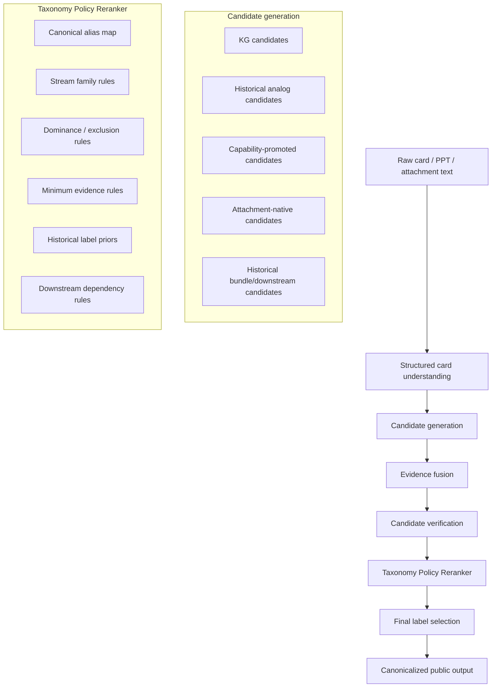
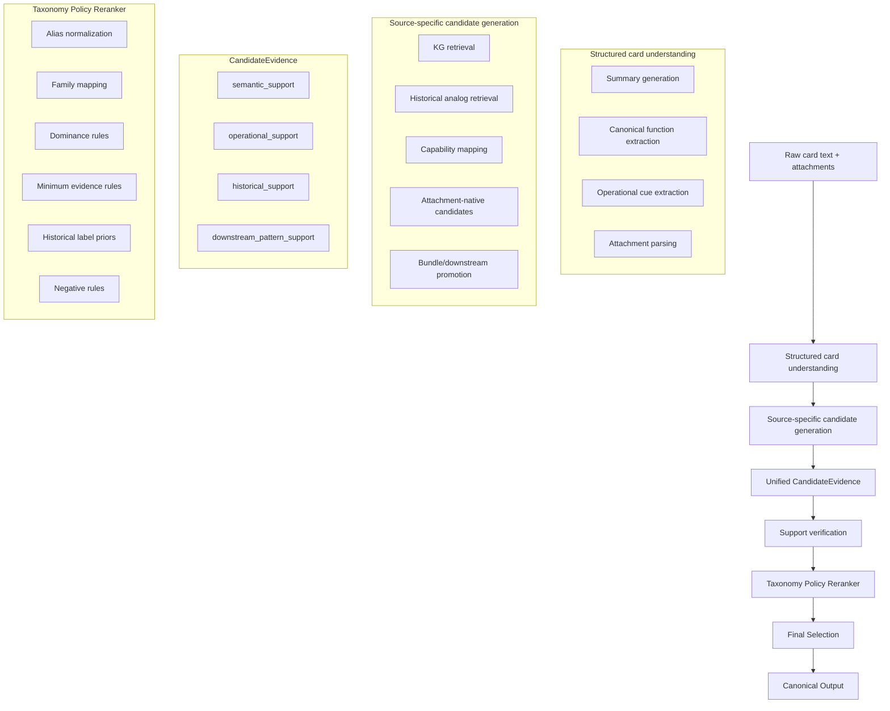

# Taxonomy-Aware Architecture Fix for `rag-summary`
## How to fix the current behavior through architecture

## 1. Goal

This document proposes a concrete architectural fix for the current failure pattern in `rag-summary`.

The goal is to move the system from:

> **semantic evidence selection**

to:

> **taxonomy-aware evidence selection**

The current system is already good at:
- understanding card content,
- retrieving historical analogs,
- retrieving KG candidates,
- applying capability mapping,
- fusing evidence,
- and verifying candidates.

But it is still weak at the final business problem:

> **Which value streams should actually survive as final labels under the company’s taxonomy?**

That is why you keep seeing behavior like:
- semantically plausible but unwanted false positives,
- missed downstream operational streams,
- inconsistent recovery of streams like CPQ, Resolve Request Inquiry, Issue Payment,
- over-selection of adjacent streams like Promote Community Health, Participate in Health Management Program, Develop Mission, Vision, and Strategy.

This document explains:
1. why the current behavior happens,
2. what the architecture is missing,
3. the proposed architecture to fix it,
4. why each new layer fixes the problem,
5. how to implement it step by step.

---

## 2. Root cause

The current system is solving the wrong version of the problem.

Right now the pipeline is mostly answering:

> “What value streams are semantically supported or plausibly implied by this card?”

But the ground truth is closer to:

> “Which value streams does the company actually assign for this initiative type under its taxonomy and label policy?”

That is a different task.

### Current mismatch

The current pipeline is strong at:
- semantic understanding,
- retrieval,
- evidence fusion,
- candidate verification.

But it is weak at:
- distinguishing **supported** vs **eligible final label**,
- enforcing company-specific dominance rules,
- enforcing minimum evidence rules per stream,
- normalizing aliases / naming drift,
- promoting downstream streams when history says they are mandatory,
- suppressing semantically adjacent but taxonomically weak streams.

So the problem is not only prompting.  
The problem is that the architecture is still missing a dedicated **taxonomy-policy layer**.

---

## 3. What is actually failing

The bad behavior you showed is coming from **three different kinds of failures**, not one.

## 3.1 Failure type A — upstream evidence / candidate generation failure

Examples:
- `Configure, Price, and Quote`
- `Resolve Request Inquiry`
- some `Issue Payment` misses
- some `Onboard Partner` misses

These streams often fail because:
- the summary/canonical extraction does not capture the right operational cues strongly enough,
- the capability map does not cover the stream well enough,
- the attachment/history layer does not promote it strongly enough into candidates.

This is **not taxonomy first**.  
This is **evidence/candidate generation failure**.

---

## 3.2 Failure type B — semantic false positives

Examples:
- `Promote Community Health`
- `Participate in Health Management Program`
- `Develop Mission, Vision, and Strategy`

These show up because:
- the text makes them semantically plausible,
- but the company does not actually want those labels for that initiative type.

This is a **taxonomy/policy failure**.

The model is saying:
> “This text is near that concept.”

But the business policy says:
> “Do not assign that label unless stronger, more specific evidence exists.”

---

## 3.3 Failure type C — downstream / organizational mapping failure

Examples:
- `Issue Payment`
- parts of `Order to Cash`
- `Manage Invoice and Payment Receipt` in some cases
- some compliance-like streams

These are often **not supposed to be recovered from direct card wording alone**.

If ground truth still expects them, they are being assigned because of:
- historical bundle patterns,
- downstream chain assumptions,
- company mapping prior for that initiative type.

This is where the current system is too weak on:
- downstream promotion,
- label priors,
- taxonomy-aware historical dominance.

---

## 3.4 Failure type D — evaluation / canonicalization failure

Examples:
- `Order to Cash` vs `Order to Cash for Group Coverage`
- `Resolve Request Inquiry` vs `Resolve Request-Inquiry`

These are not reasoning errors in the same way.  
They are **canonicalization / alias mapping errors**.

Without canonical normalization:
- the evaluation looks worse than reality,
- the system appears wrong even when it is nearly right.

---

## 4. What is missing in the architecture

The missing architectural layer is:

> **Taxonomy Policy and Label Eligibility**

Right now the architecture has:
- evidence extraction,
- candidate generation,
- evidence fusion,
- verification,
- finalization.

But it does **not** have an explicit step that asks:

> “Among all plausible and verified candidates, which ones should survive as final labels under the company’s taxonomy?”

That missing step needs to encode:
- canonical names and aliases,
- stream families,
- overlap and dominance rules,
- minimum evidence thresholds per stream,
- historical label priors,
- downstream dependency rules,
- suppression rules for semantically broad but taxonomically weak streams.

---

## 5. Proposed target architecture

## 5.1 New target flow



This is the key change:
- **Taxonomy policy reranker** becomes a first-class architectural stage.

---

## 6. New conceptual model

The most important change is to split one question into two.

### Old model
The pipeline currently treats:

- “supported by evidence”
and
- “should be selected as a final label”

as roughly the same thing.

That is wrong for this use case.

### New model
The system must produce two different judgments for each stream:

## A. Evidence support score
How strongly is this stream supported by:
- card text,
- summary,
- attachments,
- historical analogs,
- KG retrieval,
- capability mapping,
- themes.

## B. Label eligibility score
Even if supported, how likely is it to be a **valid final company label** for this initiative type?

This second score is the taxonomy score.

### Why this matters
A stream can be:
- semantically plausible,
- historically adjacent,
- partially supported,

and still **not be the right final label**.

That is exactly what is happening in your examples.

---

## 7. The new architecture in detail

## 7.1 Layer 1 — Better evidence extraction

This layer remains, but must be improved.

### What it should do
Capture:
- product launch / commercialization signals,
- pricing / quoting signals,
- member inquiry / service routing signals,
- vendor onboarding signals,
- invoice / payment / finance ops signals,
- compliance / governance signals.

### Why
Because some current misses are not taxonomy problems at all.  
They are representation failures.

### Stream families that need better extraction
- `Configure, Price, and Quote`
- `Resolve Request Inquiry`
- `Manage Invoice and Payment Receipt`
- `Issue Payment`
- `Onboard Partner`
- `Ensure Compliance`

### Examples of signals that should be upgraded

#### CPQ signals
- lower-priced
- pricing
- quote
- bid
- market parity
- product packaging
- offer configuration
- sales enablement
- commercial offer

#### Request Inquiry signals
- omni-channel
- secure messaging
- member inquiry
- self-service
- service routing
- portal request
- inquiry handling
- support request

#### Finance downstream signals
- PMPM
- invoice
- billing
- payment
- revenue ops
- payment receipt
- reconciliation
- finance operations

### Why it fixes the behavior
Because many of your false negatives happen before taxonomy even gets a chance to act.

If the right streams never become strong candidates, no downstream reranker can save them.

---

## 7.2 Layer 2 — Candidate generation with explicit downstream promotion

The current candidate generation is good, but still too weak for downstream streams.

### What to add
A dedicated **downstream/bundle candidate promotion layer**.

This layer should create candidates not only from direct semantics, but from:
- historical co-occurrence bundles,
- downstream chains,
- initiative-type priors.

### Example
If a card strongly supports:
- product launch,
- CPQ,
- leads/opportunities,
- vendor onboarding,
- invoice/payment receipt,

and historical analogs show that these often imply:
- `Issue Payment`

then `Issue Payment` should enter the candidate set as:
- `pattern_candidate`
- with `downstream_chain` or `bundle_pattern` as basis.

### Why it fixes the behavior
Because streams like `Issue Payment` are often not in direct text.  
They need to be promoted into the candidate set from historical behavior.

---

## 7.3 Layer 3 — Candidate evidence fusion

The current evidence-fusion layer is useful and should stay.

### What it already does well
- merges multiple sources,
- builds unified candidate evidence,
- tracks source count and fused score.

### What to improve
Add source-aware detail for:
- semantic support,
- operational support,
- historical dominance support,
- downstream pattern support.

### Suggested candidate evidence additions
For each candidate keep:
- `semantic_support_score`
- `operational_support_score`
- `historical_support_score`
- `downstream_pattern_score`
- `taxonomy_eligibility_score` (added later)
- `support_basis`
- `family_id`
- `canonical_id`

### Why it fixes the behavior
Because later policy decisions need richer structure than one flat fused score.

---

## 7.4 Layer 4 — Verification layer

The verify pass should stay, but its role should be narrower.

### What verify should answer
- Is the candidate actually evidence-supported?
- Is that support direct, pattern, mixed, or weak?
- What is the primary support basis?

### What verify should NOT decide
- whether the stream is the preferred final taxonomy label,
- whether a sibling/overlapping stream should dominate,
- whether the label should be suppressed by business policy.

That should move to the taxonomy layer.

### Why it fixes the behavior
Because right now your verify/finalize layer is being asked to do:
- evidence checking,
- taxonomy policy,
- overlap cleanup,
- historical label preference

all at once.

That makes it unstable.

---

## 7.5 Layer 5 — Taxonomy Policy Reranker

This is the missing layer.

### Purpose
Take the verified candidates and apply company taxonomy policy.

### Inputs
- verified candidate judgments,
- candidate evidence,
- canonical alias map,
- stream family map,
- dominance rules,
- minimum evidence rules,
- historical label priors,
- downstream dependency rules.

### Outputs
- re-scored label eligibility,
- suppressed streams,
- promoted dominant streams,
- canonicalized final label set.

### Main responsibilities

#### A. Canonicalization
Normalize:
- aliases,
- hyphen/punctuation variants,
- subtype vs parent labels.

Example:
- `Order to Cash`
- `Order to Cash for Group Coverage`

can be canonicalized under one policy bucket.

#### B. Dominance / overlap resolution
Example:
- if `Onboard Partner` and `Establish Provider Network` are both plausible,
  prefer one based on evidence type and stream family rules.

#### C. Minimum evidence enforcement
Example:
- `Promote Community Health` should require community/public/population evidence,
  not just broad health outcomes language.

#### D. Suppression of semantically broad neighbors
Example:
- broad strategic language alone should not keep `Develop Mission, Vision, and Strategy`

#### E. Historical label prior use
Example:
- for this initiative subtype, if historical dominant labels are:
  - Establish Product Offering
  - CPQ
  - Leads and Opportunities
  - Perform Engagement
  - Discover Business Insights
then adjacent labels like:
  - Develop Mission, Vision, and Strategy
  - Promote Community Health
should be down-weighted heavily unless strongly explicit.

### Why it fixes the behavior
Because this layer finally answers the real business question:

> “Which supported streams should survive as final company labels?”

That is the missing step in the current system.

---

## 7.6 Layer 6 — Final label selector

After taxonomy reranking, final selection becomes much simpler.

### Final selector should do
- choose final labels from reranked eligible candidates,
- split into:
  - directly_supported
  - pattern_inferred
  - no_evidence,
- ensure canonical names only,
- ensure no duplicate aliases,
- keep reasons concise.

### Why it fixes the behavior
Because final selection no longer has to invent policy.  
It simply reads the reranked, taxonomy-aware candidate set.

---

## 8. New architecture diagram with components



---

## 9. What artifacts to build

To make this architecture real, you need four policy artifacts.

## 9.1 Canonical stream registry
A registry for all 50 streams.

Each entry should have:
- canonical id,
- canonical name,
- aliases,
- family,
- broad vs narrow,
- legacy names,
- evaluation name.

### Example
```yaml
- id: vs_order_to_cash
  canonical_name: Order to Cash
  aliases:
    - Order to Cash for Group Coverage
    - O2C
  family: revenue_operations
  scope: parent
```

### Why it fixes the behavior
It fixes evaluation mismatches and alias drift.

---

## 9.2 Stream family / dominance rules
For overlapping streams, define which one wins.

### Example
```yaml
- family: provider_setup
  rules:
    - if evidence contains vendor_onboarding or partner_handoff:
        prefer: Onboard Partner
        suppress:
          - Establish Provider Network
    - if evidence contains network_expansion or provider_network_contracting:
        prefer: Establish Provider Network
```

### Why it fixes the behavior
It suppresses plausible-but-wrong sibling streams.

---

## 9.3 Minimum evidence rules
Per stream, define what counts as enough.

### Example
```yaml
- stream: Promote Community Health
  requires_any:
    - community outreach
    - public health
    - population health
    - community-based program
  weak_only_not_enough:
    - improve outcomes
    - reduce mortality
    - anti-stigma campaign
```

### Why it fixes the behavior
It prevents broad semantic false positives.

---

## 9.4 Historical label priors
For each initiative subtype, learn:
- dominant streams,
- adjacent streams,
- downstream-required streams,
- common co-occurrence patterns.

### Example
For product-launch commercial cards:
- dominant:
  - Establish Product Offering
  - Configure, Price, and Quote
  - Manage Leads and Opportunities
  - Perform Engagement
  - Discover Business Insights
- adjacent but weak:
  - Develop Mission, Vision, and Strategy
  - Promote Community Health

### Why it fixes the behavior
It aligns final labels with actual company mapping behavior.

---

## 10. Concrete stream-family examples

## 10.1 CPQ family

### Current issue
Cards clearly imply pricing/commercialization, but `Configure, Price, and Quote` is often under-recovered.

### Fix
Upgrade extraction and add positive rules.

#### Positive signals
- pricing
- lower-priced
- quote
- bid
- market parity
- sales enablement
- offer packaging
- commercial launch

#### Taxonomy policy
If these are present:
- boost `Configure, Price, and Quote`
- do not let broader O2C dominate unless stronger finance/order-execution evidence also exists

### Why it helps
It fixes false negatives for CPQ and prevents over-selection of broader revenue streams.

---

## 10.2 Request Inquiry family

### Current issue
Cards with portal / omni-channel / secure messaging / service handling often fail to recover `Resolve Request Inquiry`.

### Fix
Add stronger request-handling extraction.

#### Positive signals
- omni-channel
- secure messaging
- self-service portal
- inquiry
- request handling
- care-team routing
- portal support
- member service request

#### Taxonomy policy
Do not require exact phrase match.
Allow request/inquiry operations to be inferred from service-interaction patterns.

### Why it helps
It fixes false negatives caused by weak operational extraction.

---

## 10.3 Finance downstream family

### Current issue
Streams like:
- `Manage Invoice and Payment Receipt`
- `Issue Payment`
- parts of `Order to Cash`

are often missed because they are not explicit in intake text.

### Fix
Promote them through:
- downstream chains,
- historical bundle priors,
- family-level rules.

#### Example rule
If:
- commercial launch,
- O2C,
- invoice/payment receipt,
- recurring PMPM / finance ops

are all present in evidence or analog bundles,

then:
- promote `Issue Payment` as `pattern_inferred`.

### Why it helps
It recovers streams that are label-policy downstream, not direct-text streams.

---

## 10.4 Community Health false-positive family

### Current issue
Broad outcome language causes `Promote Community Health` to survive too often.

### Fix
Require stronger community/public-health evidence.

#### Not enough by itself
- reduce mortality
- improve outcomes
- anti-stigma campaign
- behavioral health improvement

#### Required stronger evidence
- public health
- community outreach
- population health
- community intervention network
- local/community partner program

### Why it helps
It suppresses semantically broad but taxonomically wrong labels.

---

## 10.5 Strategic-language false-positive family

### Current issue
Cards with high-level goals trigger `Develop Mission, Vision, and Strategy`.

### Fix
Make strategy a protected stream.

#### Not enough
- strategic goal
- investment owner
- business owner
- prepare for competition
- growth goal

#### Required
- explicit strategy workstream
- planning charter
- strategic operating model
- mission/vision planning artifacts

### Why it helps
It removes broad-goal false positives.

---

## 11. How this new architecture fixes the examples you showed

## Example family 1 — product launch / commercialization cards
Current problem:
- over-select broad adjacent streams
- under-recover CPQ and request-handling families
- unstable O2C selection

Fix:
- stronger commercial extraction
- CPQ positive rules
- O2C dominance constraints
- taxonomy reranker suppressing weak strategic/adjacent labels

Result:
- better CPQ recall
- fewer false positives like Develop Mission, Vision, and Strategy

---

## Example family 2 — behavioral health program cards
Current problem:
- over-select community-health / health-management adjacency
- under-separate product/engagement vs community/public-health labeling
- downstream streams partly unstable

Fix:
- negative rules for Community Health and Health Management Program
- stronger policy that BH program + outreach != community health by default
- downstream finance/ops promotion only when analog bundles justify it

Result:
- fewer semantic neighbor false positives
- better alignment to company labels

---

## Example family 3 — vendor / onboarding / operational cards
Current problem:
- `Onboard Partner` unstable
- provider-program / provider-network / partner streams overlap badly

Fix:
- stream-family dominance rules
- evidence-type-aware preference rules
- canonicalization and family suppression

Result:
- fewer sibling overlaps
- better final label stability

---

## 12. Implementation order

## Phase 1 — Evaluation and policy foundations
Build:
- canonical alias map
- family registry
- evaluation normalizer

Why first:
- it immediately improves measurement quality
- it separates real misses from naming mismatches

---

## Phase 2 — Evidence extraction upgrades
Upgrade:
- pricing / quote extraction
- request/inquiry extraction
- finance downstream cue extraction
- stronger attachment operational extraction

Why second:
- many misses are upstream candidate failures, not policy failures

---

## Phase 3 — Downstream promotion logic
Add:
- bundle-based promotion
- downstream chain promotion
- label-prior-based promotion for low-direct streams

Why third:
- this is how you recover streams like `Issue Payment`

---

## Phase 4 — Taxonomy policy reranker
Add:
- alias normalization
- family rules
- dominance rules
- minimum evidence rules
- negative suppression rules
- historical prior weighting

Why fourth:
- this is the core business-alignment fix

---

## Phase 5 — Final selector simplification
Make final selector only:
- choose from reranked candidates
- split direct/pattern/no-evidence
- emit canonical names

Why fifth:
- final selection becomes simpler and more stable once policy is upstream

---

## 13. Why this architecture is the right fix

Because it directly addresses the real failure mode.

### Current system
Good at:
- semantic evidence

Bad at:
- final company label policy

### Proposed system
Good at:
- semantic evidence
- operational evidence
- downstream promotion
- taxonomy policy
- canonical final label selection

This is exactly the missing piece.

---

## 14. Final conclusion

The current behavior is happening because the system is still functioning mainly as a:

> **semantic evidence engine**

while your business problem requires a:

> **taxonomy-aware selection engine**

So the fix is not only:
- prompt tuning,
- or threshold tuning.

The fix is architectural.

### The key architectural addition is:
> **Taxonomy Policy Reranker**

That layer should sit **after verification** and **before final selection**.

It will:
- normalize aliases,
- enforce company label policy,
- apply dominance rules,
- suppress semantically broad false positives,
- preserve historically dominant streams,
- allow downstream streams when history requires them.

That is how you get from “plausible streams” to “correct company labels.”

---

## 15. Build directive

Build this architecture in order:

1. canonical registry and alias map
2. better extraction for missing stream families
3. downstream bundle/chain promotion
4. taxonomy policy reranker
5. simplified final selector

That is the cleanest and most reliable path to fixing the current behavior.
